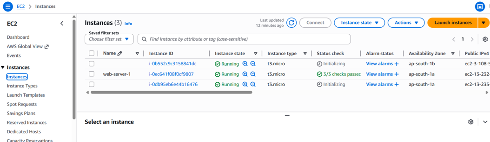
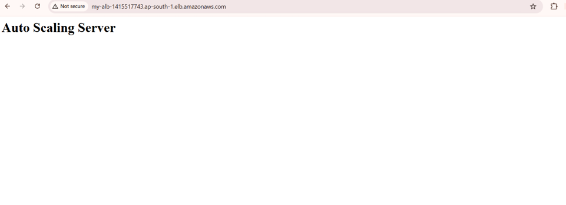

# Scalable-Web-App-with-ALB-and-Auto-Scaling
AWS project using EC2, Application Load Balancer, and Auto Scaling for automatic scaling and load distribution.

## Project Screenshots

### 1. Auto Scaling Group Creation
This screenshot shows the creation and configuration of the Auto Scaling Group used to automatically increase or decrease EC2 instances based on traffic load.

### 2. Load Balancer
This screenshot displays the Application Load Balancer configuration that distributes incoming traffic across multiple EC2 instances for high availability.

### 3. Target Group
This screenshot shows the Target Group configuration where EC2 instances are registered and health checks are managed.

### 4. EC2 Instances
This screenshot displays the running EC2 instances created for hosting the scalable web application.

### 5. Application Output
This screenshot shows the successful deployment and running output of the web application through the load balancer endpoint.

### 6. Application Output 2
This screenshot demonstrates another successful response from the application, proving load balancing and scalability functionality.

### 7. ALB Security Group
This screenshot shows the security group rules configured for the Application Load Balancer to allow HTTP traffic from users.

### 8. EC2 Security Group
This screenshot displays the security group attached to EC2 instances allowing traffic from the Load Balancer securely.

